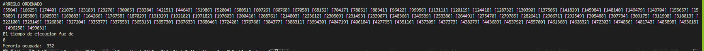
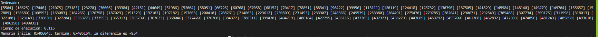
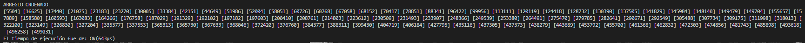
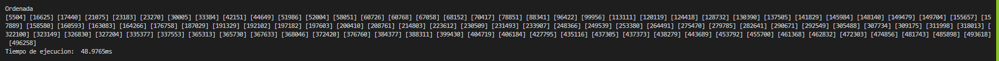

# AnalisisDeAlgoritmos_Caso3

Especificación del sistema

Processor: Intel(R) Core(TM) i7-3770 CPU @ 3.40GHZ 3.40 GHz
Installed memory (RAM): 16.0 GB
System type: 64-bit Operating System, x64-based processor

Pasos de prueba
- Se programó en Rust, Go y C++ un algoritmo de Bubble Sort y se aplicón con un array de 100 elemento idéntico en los 3
- Se usaron las funciones internas de cada lenguaje para medir el tiempo de ejecución y la cantidad de memoria usada.

Capturas:

Resultados de C:

Resultados de C++:

Resultados de Rust:

Resultados de Go:

